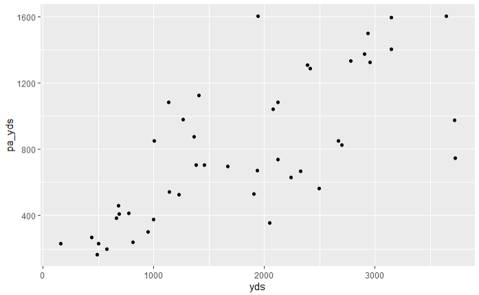

# Weekly Performance by Stat Category {#sec-weeklyPerformance}

This chapter covers weekly player performance across key statistical categories.

## Passing {#sec-weeklyPassing}

### Pass Attempts {#sec-weeklyPassAttempts}

#### Completed Pass {#sec-weeklyCompletedPass}

#### Incomplete Pass {#sec-weeklyIncompletePass}

#### Interceptions {#sec-weeklyInterceptions}

#### Pass TDs {#sec-weeklyPassTDs}

### Pass Yardage {#sec-weeklyPassYardage}

#### Air Yards {#sec-weeklyAirYards}

#### Passing Yards {#sec-weeklyPassingYards}

#### YAC {#sec-weeklyYAC}

### Passing Metrics {#sec-weeklyPassingMetrics}

#### CP {#sec-weeklyCP}

#### CPOE {#sec-weeklyCPOE}

### Passer Play {#sec-weeklyPasserPlay}

#### Dropback {#sec-weeklyDropback}

#### Hits {#sec-weeklyHits}

#### Sacks {#sec-weeklySacks}

#### Pass_oe {#sec-weeklyPassOE}

#### xpass {#sec-weeklyXpass}

## Rushing {#sec-weeklyRushing}

This is some text about rushing performance.

```{r}
#| eval: false
result <- player_stats_weekly %>%
  filter(
    player_id == "00-0038134",
    season == 2025,
    position == "RB"
  ) %>%
  summarise(
    player_id   = first(player_id),
    player_name = first(player_name),
    team        = first(team),
    tds         = sum(rushing_tds, na.rm = TRUE),
    yards       = sum(rushing_yards, na.rm = TRUE)
  )
print(result)
```


```{r}
#| eval: false
library(DBI)
library(RSQLite)
con <- dbConnect(RSQLite::SQLite(), dbname = "E:/NFL Stata Data/nflfast2026/database_25.db")
```

```{sql}
--| eval: false
--| connection: con
SELECT player_id, player_name, team, SUM(rushing_tds) AS tds, SUM(rushing_yards) AS yards
FROM main.nfl_actualStats_player_weekly
WHERE player_id = '00-0038134' AND
      season = 2025 AND
      season_type = 'REG' AND
      position = 'RB';
```



## Receiving {#sec-weeklyReceiving}

## Kicking {#sec-weeklyKicking}

## Offensive Line Play {#sec-weeklyOLine}

## Defensive Play {#sec-weeklyDefense}
